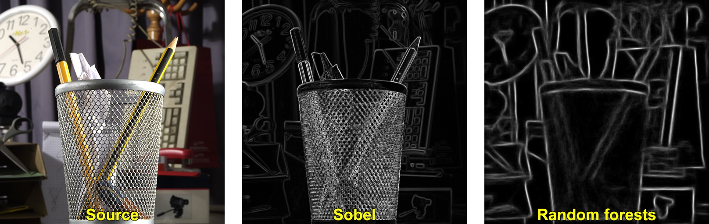
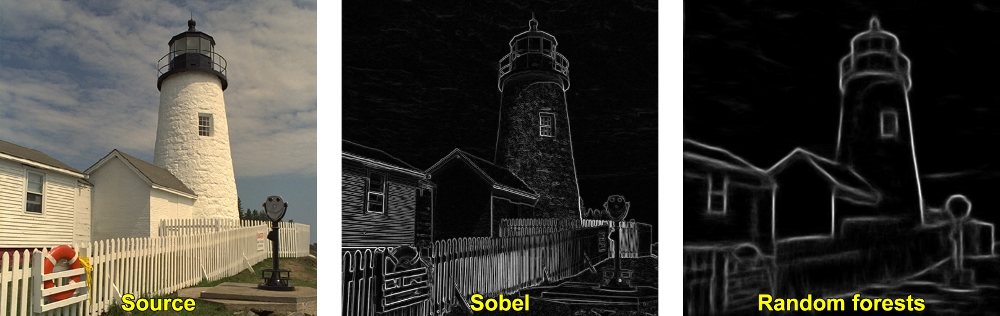
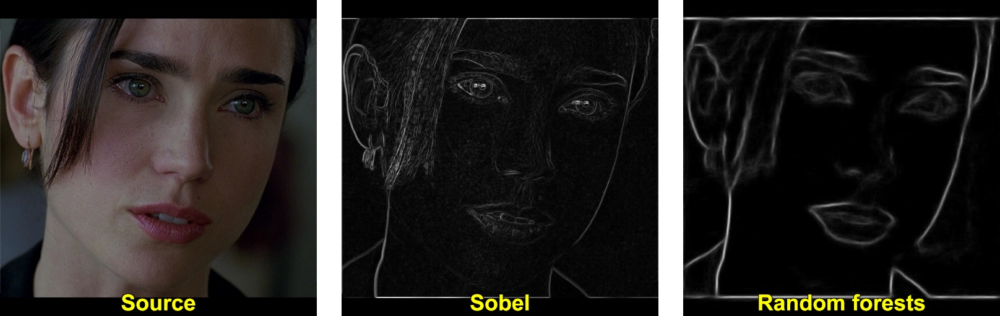
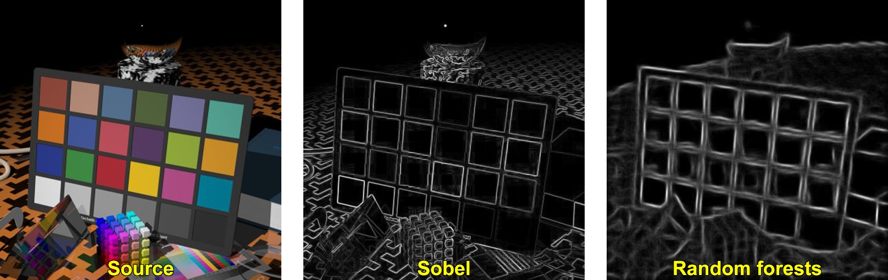
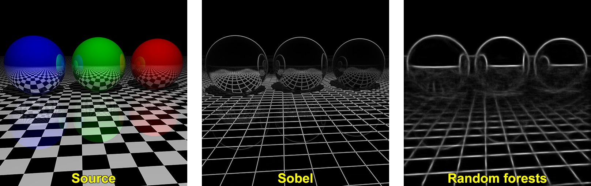
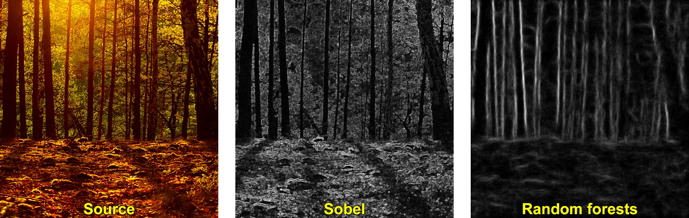
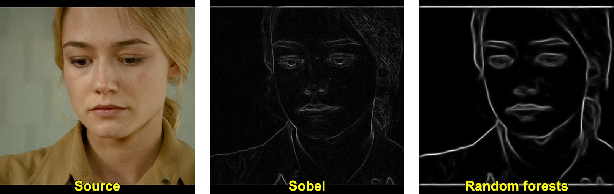

.. ximgproc:

Structured forests for fast edge detection
******************************************

Introduction
------------
In this tutorial you will learn how to use structured forests for the purpose of edge detection in an image.

Examples
--------

.. image:: images/01.jpg
  :height: 238pt
  :width:  750pt
  :alt: First example
  :align: center

.. image:: images/03.jpg
  :height: 238pt
  :width:  750pt
  :alt: First example
  :align: center

.. image:: images/05.jpg
  :height: 238pt
  :width:  750pt
  :alt: First example
  :align: center

.. image:: images/08.jpg
  :height: 238pt
  :width:  750pt
  :alt: First example
  :align: center

.. image:: images/09.jpg
  :height: 238pt
  :width:  750pt
  :alt: First example
  :align: center

**Note :** binarization techniques like Canny edge detector are applicable
           to edges produced by both algorithms (``Sobel`` and ``StructuredEdgeDetection::detectEdges``).

Source Code
-----------

.. literalinclude:: ../../../../modules/ximpgroc/samples/cpp/structured_edge_detection.cpp
   :language: cpp
   :linenos:
   :tab-width: 4

Explanation
-----------

1. **Load source color image**

  .. code-block:: cpp

    cv::Mat image = cv::imread(inFilename, 1);
    if ( image.empty() )
    {
        printf("Cannot read image file: %s\n", inFilename.c_str());
        return -1;
    }

2. **Convert source image to [0;1] range**

  .. code-block:: cpp

    image.convertTo(image, cv::DataType<float>::type, 1/255.0);

3. **Run main algorithm**

  .. code-block:: cpp

    cv::Mat edges(image.size(), image.type());

    cv::Ptr<StructuredEdgeDetection> pDollar =
        cv::createStructuredEdgeDetection(modelFilename);
    pDollar->detectEdges(image, edges);

4. **Show results**

  .. code-block:: cpp

    if ( outFilename == "" )
    {
        cv::namedWindow("edges", 1);
        cv::imshow("edges", edges);

        cv::waitKey(0);
    }
    else
        cv::imwrite(outFilename, 255*edges);

Literature
----------
For more information, refer to the following papers :

.. [Dollar2013] Dollar P., Zitnick C. L., "Structured forests for fast edge detection",
                IEEE International Conference on Computer Vision (ICCV), 2013,
                pp. 1841-1848. `DOI <http://dx.doi.org/10.1109/ICCV.2013.231>`_

.. [Lim2013] Lim J. J., Zitnick C. L., Dollar P., "Sketch Tokens: A Learned
             Mid-level Representation for Contour and Object Detection",
             Comoputer Vision and Pattern Recognition (CVPR), 2013,
             pp. 3158-3165. `DOI <http://dx.doi.org/10.1109/CVPR.2013.406>`_
