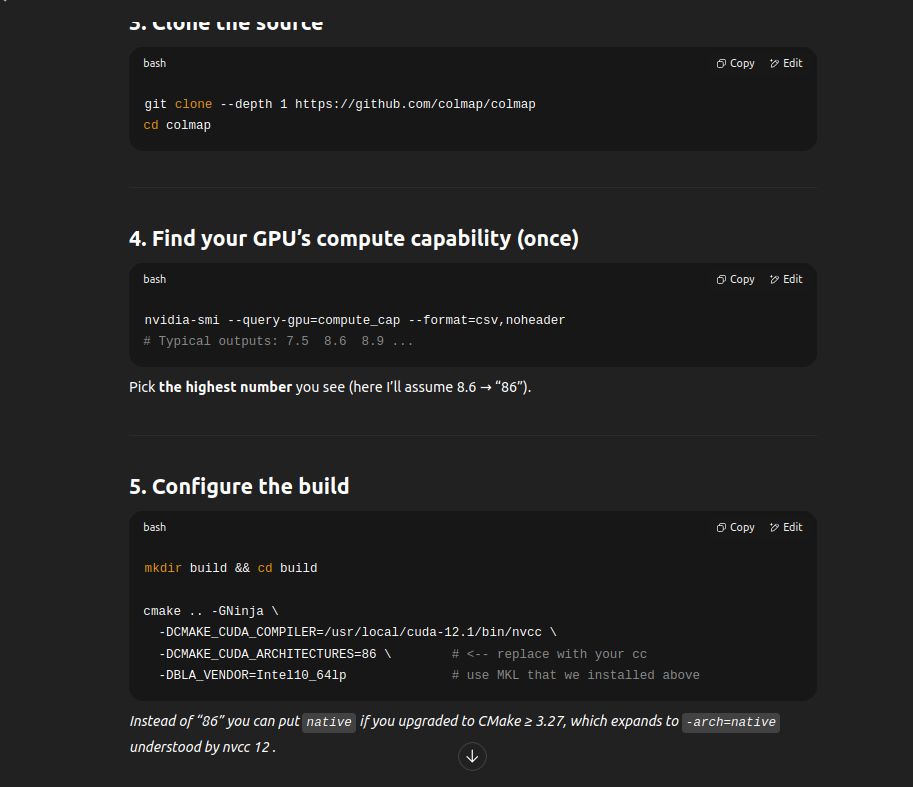
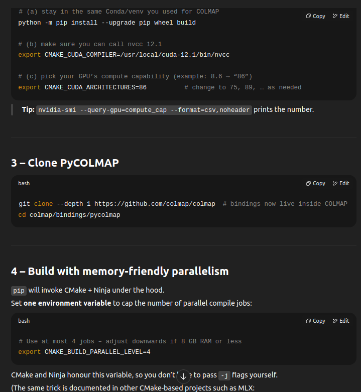

# Structure From Motion (SfM) - README


https://github.com/user-attachments/assets/f489a554-299e-41ad-a4b4-436e32d8cbd5


## IMPORTANT - LightGlue Installation- 
- 1st do this
```
git clone https://github.com/cvg/LightGlue.git && cd LightGlue
python -m pip install -e .
```
- 2nd download data
  - https://rpg.ifi.uzh.ch/docs/teaching/2024/kitti05.zip

  - put it in folder named 'Dataset'

- 3rd
  - intall ```requirements.txt```
  - ```bash scripts/run_tracker_visualization.sh```

## INSTALLING COLMAP

use this command - ```ninja -j4 -l 8 > build.log 2>&1```


for pycolmap - https://colmap.github.io/pycolmap/index.html#pycolmap-index

refer the image if when running the command it freezes and crashes



## Overview

This repository contains two Python scripts that demonstrate basic Structure-from-Motion (SfM) pipelines:

1. **sfm.py**  
   - A more classical approach that uses standard OpenCV feature detectors (e.g., SIFT, ORB, AKAZE) and BFMatcher or FLANN to match keypoints between images.  
   - Performs pose estimation (essential matrix or PnP) and triangulation to build a sparse map of 3D points.  
   - Uses optional non-linear refinement via scipy’s least squares to improve the estimated camera pose.

2. **sfm_lightglue_aliked.py**  
   - An enhanced pipeline that integrates neural network-based feature extraction (**ALIKED**) and feature matching (**LightGlue**).  
   - Demonstrates how modern, learned feature detectors and matchers can improve keypoint reliability and reduce drift.  
   - Also includes the same core SfM steps (pose estimation, triangulation, optional non-linear refinement).  
   - Tracks a simple **Absolute Trajectory Error (ATE)** and accumulates a **cumulative translation error** for quick performance checks.

Both scripts are **prototypes** designed primarily for **concept validation and experimentation**. For real-time, production-grade implementations, it’s recommended to integrate a C++ back end (e.g., [Ceres Solver](https://github.com/ceres-solver/ceres-solver)) for optimization and manage heavy-lifting tasks in a more performant environment.

---

## Features

### Common SfM Steps
- **Dataset Loading** (KITTI, Malaga, or custom folder with images).  
- **Camera Calibration** for loading intrinsic/extrinsic parameters.  
- **Feature Extraction**  
  - sfm.py: classical (SIFT, ORB, AKAZE)  
  - sfm_lightglue_aliked.py: ALIKED (learned keypoints + descriptors)  
- **Feature Matching**  
  - sfm.py: BFMatcher or FLANN  
  - sfm_lightglue_aliked.py: LightGlue (neural network-based matching)  
- **Motion Estimation**  
  - 2D-2D with essential matrix.  
  - 2D-3D with PnP (once 3D map points are available).  
- **Triangulation**  
  - Convert 2D matches into 3D points.  
- **Non-linear Refinement**  
  - Uses scipy’s Levenberg-Marquardt (`least_squares`) to minimize reprojection error.  
- **Basic Stereo Handling** (KITTI, Malaga)  
  - Combine left and right images for better scale recovery if stereo calibration is present.  
- **Trajectory Evaluation**  
  - **ATE** (Absolute Trajectory Error) if ground truth is available.  
  - A simple “cumulative translation error” measure.

---

## Requirements

- **Python 3.7+**  
- **OpenCV** (>= 4.x recommended)  
- **NumPy**  
- **Matplotlib** (for visualization)  
- **scipy** (for non-linear refinement)  
- **tqdm** (for progress bars)  
- **PyTorch** (only required for sfm_lightglue_aliked.py, if using LightGlue + ALIKED)  
- **lightglue** (the Python package for the LightGlue matching framework)  

---

## Usage

### 1. Cloning & Installation
1. Clone this repository:
   ```bash
   git clone https://github.com/your-organization/your-repo.git
   ```
2. Install dependencies:
   ```bash
   pip install -r requirements.txt
   ```
   Or individually:
   ```bash
   pip install opencv-python numpy matplotlib scipy tqdm torch
   # plus LightGlue if not already installed
   ```

### 2. Running **sfm.py**
```bash
python sfm.py --dataset kitti --data_path ./Dataset/kitti
```
- **Arguments**:
  - `--dataset`: name of the dataset (kitti, malaga, or custom).  
  - `--data_path`: path to the dataset folder.
- **Behavior**:
  - Loads images, performs feature detection + matching (SIFT, ORB, AKAZE), estimates camera motion, triangulates points.
  - Optionally runs non-linear refinement on the pose.
  - Plots or logs the results (trajectory, errors).

*(Adjust arguments to match your own script’s CLI if needed.)*

### 3. Running **sfm_lightglue_aliked.py**
```bash
python sfm_lightglue_aliked.py --dataset kitti --data_path ./Dataset/kitti --use_lightglue True
```
- **Arguments**:
  - `--dataset`: name of the dataset (kitti, malaga, or custom).  
  - `--data_path`: path to the dataset folder.  
  - `--use_lightglue`: enable or disable ALIKED + LightGlue pipeline.
- **Behavior**:
  - Loads images, runs ALIKED for feature extraction, and LightGlue for matching (GPU if available).
  - Estimates camera motion, triangulates points, performs non-linear refinement if configured.
  - Computes:
    - **ATE** (Absolute Trajectory Error)  
    - A “cumulative translation error” measure  
  - Optionally displays debug visualizations (keypoints, matches, trajectory).

### 4. Visualizations
- **Matplotlib** windows may pop up showing:
  - Keypoints and matches for consecutive frames.
  - The evolution of the 3D point cloud (if any).
  - The camera’s estimated trajectory vs. ground truth (if available).

### 5. Customization
- Modify `THUMPUP_POS_THRESHOLD` and `THUMPUP_ROT_THRESHOLD` for keyframe selection.  
- Tweak the **maximum keypoints** or **confidence** in `ALIKED` or **LightGlue** for performance vs. accuracy trade-offs.  
- Adjust RANSAC thresholds or non-linear refinement parameters (in `refine()` method) for more robust or faster solutions.

---

## Implementation Details

- **sfm.py**
  - Uses OpenCV for feature detection (SIFT, ORB, or AKAZE).  
  - BFMatcher or FLANN for matching.  
  - Essential matrix / PnP for pose.  
  - Minimal keyframe selection logic.  

- **sfm_lightglue_aliked.py**
  - ALIKED for learned keypoints + descriptors, LightGlue for matching.  
  - Similar pose estimation logic (PnP, essential matrix).  
  - Triangulation + refinement steps are nearly the same.  
  - Typically yields more reliable matches and lower drift.

- **Stereo** logic (KITTI, Malaga) uses left/right cameras for absolute scale.  
- **Monocular** is scale-invariant and can produce an arbitrary scale.  
- **Error Metrics**:  
  - **ATE**: Norm of translation difference from ground truth.  
  - **Cumulative translation error**: Summation of frame-by-frame translation offsets.

---

## Performance & Future Directions

- **Python Prototyping**: Great for algorithmic experimentation but can be slower for large-scale or real-time tasks.
- **Production-Grade**: Offload heavy steps (bundle adjustment, large-scale optimization) to C++.
- **Loop Closure & Full SLAM**: These scripts focus on **Visual Odometry**. Future expansions may include place recognition, pose graph optimization, etc.

---

