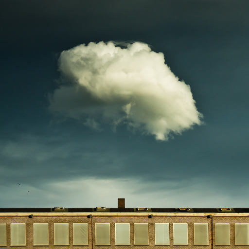

=======================================
Boost Color
=======================================
Makes colors more saturated.

.. cpp:function:: int boostColor(cv::InputArray src, cv::OutputArray dst, float intensity = 0.0f)

   :param src: RGB image.
   :param dst: Destination image of the same size and the same type as **src**.
   :param intensity: Effect intensity, must be real number from 0.0 to 1.0.
   :return: Error code.

The algorithm.

#. Create 3-channel image, which is interpreted as HLS image

#. Each element of the 3rd (Saturation) channel increases by **intensity**

#. Save this matrix as RGB image

Example.

|src| |dst|

.. |dst| image:: pics/boost_color_after.jpg
   :width: 40%
