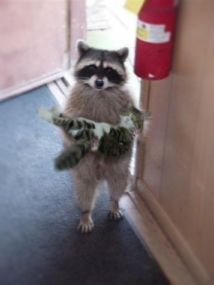

=======================================
Edge Blur
=======================================
Blurs the edges of an image, keeping center in focus.

.. ocv:function:: void edgeBlur(InputArray src, OutputArray dst, int indentTop, int indentLeft)

   :param src: RGB image.
   :param dst: Destination image of the same size and the same type as **src**.
   :param indentTop: The indent from the top and the bottom of the image. It will be blured.
   :param indentLeft: The indent from the left and right side of the image. It will be blured.

The algorithm.

      1. Apply boxFilter to the src image.

      2. For each pixel (x, y) in dst

          * Calculate distance:

          .. math::
            dist(x, y) = \frac{(x - x_c)^2}{a^2} + \frac{(y - y_c)^2}{b^2},

          where :math:`(x_c, y_c)` - center of the image, :math:`a = x_c - indentLeft, b = y_c - indentTop`.

          * Form the mask:

          .. math::
            mask(x, y) = \left\{
                    \begin{array}{lll}
                        0 & \quad dist(x, y) \leq 0.75\\
                        2 * dist(x, y) + 1.5 & \quad dist(x, y ) \in (0.75, 1.25]\\
                        1 & \quad dsit(x, y) > 1.25
                    \end{array}
                \right.

          * Result

          .. math::
            dst = boxFilter(src) * mask + src * (1 - mask)

Example.

    **indentTop** = 90, **indentLeft** = 90.

|src| |dst|

.. |src| image:: pics/edge_blur_before.png
   :width: 40%

