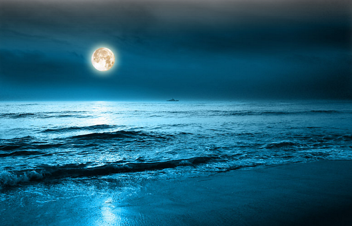

=======================================
Film Grain
=======================================
Applies film grain effect to the initial image.

.. cpp:function:: void filmGrain(InputArray src, OutputArray dst, int grainValue, RNG& rng)

   :param src: Grayscale or RGB image.
   :param dst: Destination image of the same size and the same type as **src**.
   :param grainValue: Degree of graininess. 8 is default value.
   :param rng: Random number generator. cv::theRNG() is default value.

The algorithm.

1. Create matrix with noise.
2. Add noise to image.

Example.

|srcImage| |dstImage|

