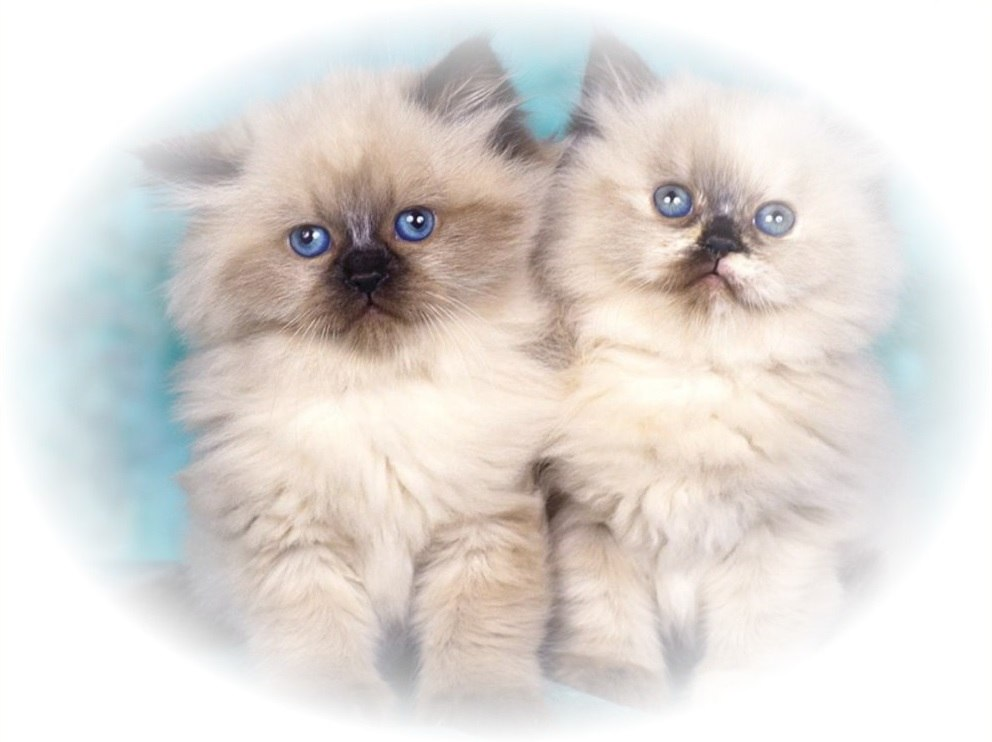

=======================================
Matte
=======================================
Increases the brightness of peripheral pixels.

.. ocv:function:: void matte(cv::InputArray src, cv::OutputArray dst, float sigma)

   :param src: RGB image.
   :param dst: Destination image of the same size and the same type as **src**.
   :param sigma: Size of the white area at the edges.

The algorithm.

#. For every pixel of the src image calculate  dist and  coefficient.
#. Dist is an amount, which describes a distance from the current pixel to border of the ellipse.
#. Coefficient is a number which cuts a part of the channel's intensity of the src image (value is in the range  [0, 1] ).
#. New value stores to the dst image.
#. The  coefficient is calculated by the following formula:

    coef = 1 - ( ( dist - 1 ) / radiusMax );
    coef = -2 * coef * coef * coef * coef * coef + 4 * coef * coef * coef - coef,
    
    where  radiusMax is a maximum distance from border of the ellipse to the farthest pixel (a corner of the image).

Example.

    sigma = 25.

|srcImage| |dstImage|

