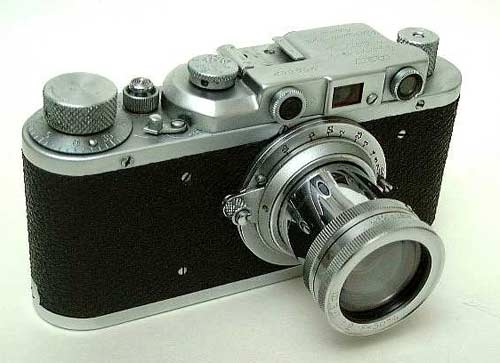
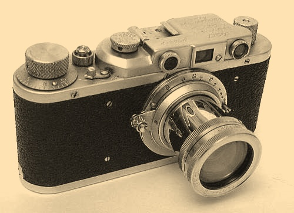

=======================================
Sepia
=======================================
Applies sepia effect to image.

.. ocv:function:: void sepia(cv::InputArray src, cv::OutputArray dst)

   :param src: Source 8-bit single-channel image.
   :param dst: Destination image of the same size and the same type as **src**.

The algorithm.

#. Create 3-channel image, which is interpreted as HSV image.

    #. 1st channel is the matrix, each element equals **hue** = 19.
    #. 2nd channel is the matrix, each element equals **saturation** = 78.
    #. 3rd channel is the matrix of brightness (**src** + **value** = **src** + 20).

#. Convert resulting image to BGR format.

Example.

|srcImage| |dstImage|

