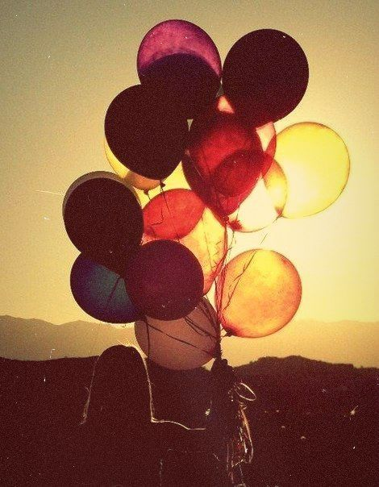
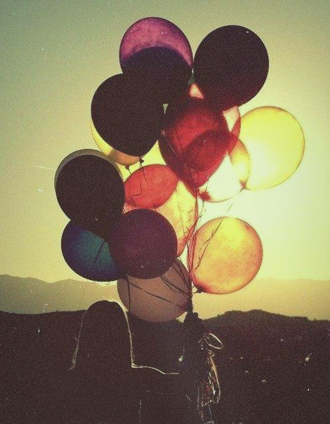

=======================================
Tint
=======================================
Add a tint to the image.

.. cpp:function:: void tint(cv::InputArray src, cv::OutputArray dst, const cv::Vec3b &colorTint, float density)

   :param src: Source 8-bit 3-channel (RGB) image.
   :param dst: Destination image of the same size and the same type as **src**.
   :param colorTint: It's a bearing color. All color of the image **src** will be shifted to it.
   :param density: Float value between 0 and 1, defines a range of shift to the colorTint.

The algorithm:

    Calculate new values by the formula:

    .. math::

       dst(x, y) = density \cdot src(x, y) + (1 - density) \cdot colorTint

Example:

    **density** = 0.1, **colorTint** = Vec3b(255, 255, 0), i.e. cyan.

|srcImage| |dstImage|

