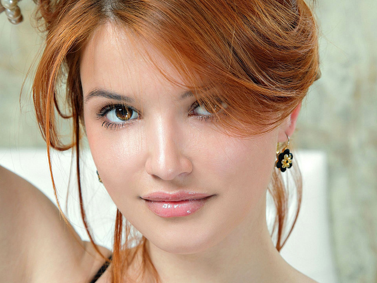
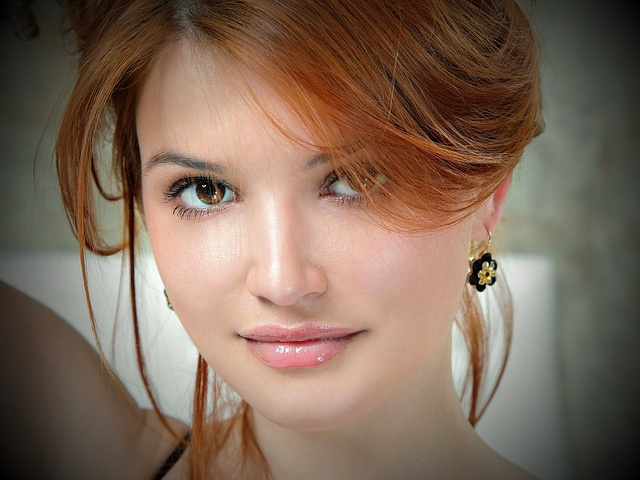

=========================================
Vignette
=========================================

Makes the edges of the photo less bright, creating an oval frame around its central part.

.. ocv:function:: void vignette(cv::InputArray src, cv::OutputArray dst, cv::Size rect)

   :param src: Source 3-channel image.
   :param dst: Destination image of the same size and the same type as **src**.
   :param rect: Size of rectangle describes an ellipse, whose center is at the center of an image.

The algorithm.

 For every pixel of the **src** image calculate :math:`dist` and :math:`coefficient`, where
  :math:`dist` is an amount, which describes a distance from the current pixel to border of the ellipse;
  :math:`coefficient` is a number which cuts a part of the channel's intensity of the **src** image (value is in the range :math:`[0, 1]`). New value stores to the **dst** image.

  The :math:`coefficient` is calculated by the following formula:

  .. math::

   coefficient = 1 - ((dist - 1) / radiusMax),

  where :math:`radiusMax` is a maximum distance from border of the ellipse to the farthest pixel (a corner of the image).

Example.

|srcImage| |dstImage|

