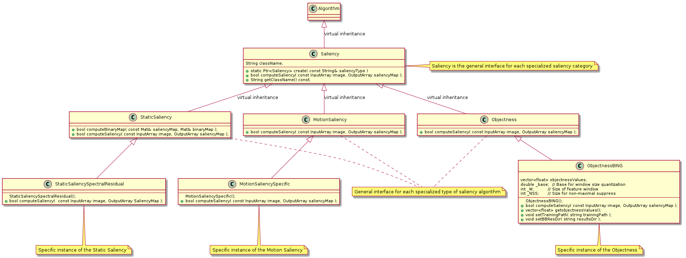

Saliency API
============

.. highlight:: cpp

Many computer vision applications may benefit from understanding where humans focus given a scene. Other than cognitively understanding the way human perceive images and scenes, finding salient regions and objects in the images helps various tasks such as speeding up object detection, object recognition, object tracking and content-aware image editing.

About the saliency, there is a rich literature but the development is very fragmented. The principal purpose of this API is to give a 
unique interface, a unique framework for use and plug sever saliency algorithms, also with very different nature and methodology, but they share the same purpose, organizing algorithms into three main categories:

**Static Saliency**: algorithms belonging to this category, exploit different image features that allow to detect salient objects in a non dynamic scenarios. 

**Motion Saliency**: algorithms belonging to this category, are particularly focused to detect salient objects over time (hence also over frame), then there is a temporal component sealing cosider that allows to detect "moving" objects as salient, meaning therefore also the more general sense of detection the changes in the scene.

**Objectness**: Objectness is usually represented as a value which reflects how likely an image window covers an object of any category. Algorithms belonging to this category, avoid making decisions early on, by proposing a small number of category-independent proposals, that are expected to cover all objects in an image. Being able to perceive objects before identifying them is closely related to bottom up visual attention (saliency).

UML design: 

-----------

**Saliency diagram**

To see how API works, try tracker demo: https://github.com/fpuja/opencv_contrib/blob/saliencyModuleDevelop/modules/saliency/samples/computeSaliency.cpp

.. note:: This Tracking API has been designed with PlantUML. If you modify this API please change UML files under modules/tracking/misc/

Saliency classes:
-----------------

.. toctree::
    :maxdepth: 2

    common_interfaces_saliency
    saliency_categories
    static_saliency_algorithms
    motion_saliency_algorithms
    objectness_algorithms
    

