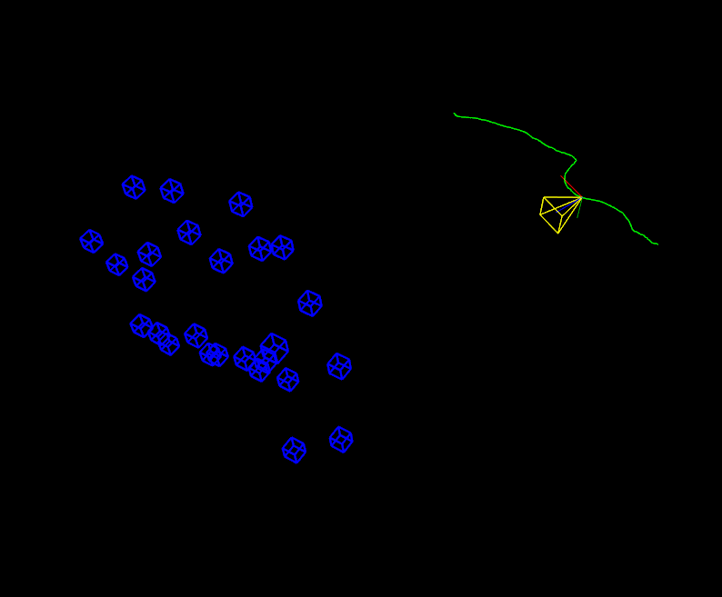
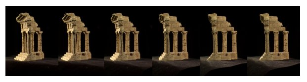
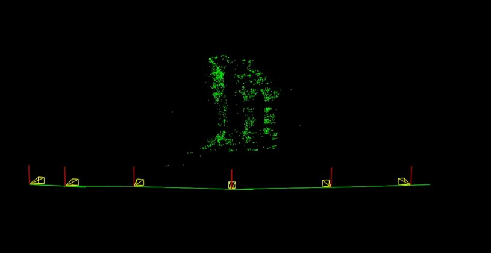
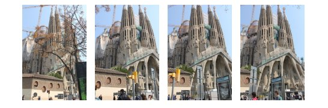
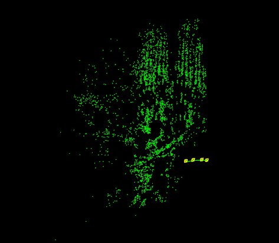

Structure From Motion module
============================

This module contains algorithms to perform 3d reconstruction from 2d images. The core of the module is a light version of [Libmv](https://developer.blender.org/project/profile/59), which is a Library for Multiview Reconstruction (or LMV) divided into different modules (correspondence/numeric/multiview/simple_pipeline) that allow to resolve part of the SfM process.

Dependencies
------------

Before compiling, take a look at the following details in order to give a proper use of the Struncture from Motion module. **Advice:** The module is only available for Linux/GNU systems.

In addition, it depends on some open source libraries:

- [Eigen](http://eigen.tuxfamily.org/index.php?title=Main_Page) 3.2.2 or later. **Required**
- [Google Log](http://code.google.com/p/google-glog) 0.3.1 or later. **Required**
- [Google Flags](http://code.google.com/p/gflags). **Required**
- [Ceres Solver](http://ceres-solver.org). Needed by the reconstruction API in order to solve part of the Bundle Adjustment plus the points Intersect. If Ceres Solver is not installed on your system, the reconstruction funcionality will be disabled. **Recommended**

Installation
------------
**Required Dependencies**

In case you are on [Ubuntu](http://www.ubuntu.com/) you can simply install the required dependencies by typing the following command.

    sudo apt-get install libeigen3-dev libgflags-dev libgoogle-glog-dev

**Ceres Solver**

Start by installing all the dependencies.

    # CMake
    sudo apt-get install cmake
    # google-glog + gflags
    sudo apt-get install libgoogle-glog-dev
    # BLAS & LAPACK
    sudo apt-get install libatlas-base-dev
    # Eigen3
    sudo apt-get install libeigen3-dev
    # SuiteSparse and CXSparse (optional)
    # - If you want to build Ceres as a *static* library (the default)
    #   you can use the SuiteSparse package in the main Ubuntu package
    #   repository:
    sudo apt-get install libsuitesparse-dev
    # - However, if you want to build Ceres as a *shared* library, you must
    #   add the following PPA:
    sudo add-apt-repository ppa:bzindovic/suitesparse-bugfix-1319687
    sudo apt-get update
    sudo apt-get install libsuitesparse-dev

We are now ready to build, test, and install Ceres.

    git clone https://ceres-solver.googlesource.com/ceres-solver
    cd ceres-solver
    mkdir build && cd build
    cmake ..
    make -j4
    make test
    sudo make install

Usage
-----

**trajectory_reconstruction.cpp**

This program shows the camera trajectory reconstruction capabilities in the OpenCV Structure From Motion (SFM) module. It loads a file with the tracked 2d points over all the frames which are embedded into a vector of 2d points array, where each inner array represents a different frame. Every frame is composed by a list of 2d points which e.g. the first point in frame 1 is the same point in frame 2. If there is no point in a frame the assigned value will be (-1,-1).

To run this example you can type the following command in the opencv binaries directory specifying the file path in your system and the camera intrinsics (in this case the tracks file was obtained using Blender Motion module).

    ./example_sfm_trajectory_reconstruction tracks_file.txt 1914 640 360

Finally, the script reconstructs the given set of tracked points and show the result using the OpenCV 3D visualizer (viz). On the image below, it's shown a screenshot with the result you should obtain running the "desktop_tracks.txt" found inside the samples directory.

  

**scene_reconstruction.cpp**

This program shows the multiview scene reconstruction capabilities in the OpenCV Structure From Motion (SFM) module. It calls the recontruction API using the overloaded signature for real images. In this case the script loads a file which provides a list with all the image paths that we want to reconstruct. Internally, this script extract and compute the sparse 2d features using DAISY descriptors which are matched using FlannBasedMatcher to finally build the tracks structure.

To run this example you can type the following command in the opencv binaries directory specifying the file path  and the camera intrinsics.

    ./example_sfm_scene_reconstruction image_paths_file.txt 350 240 360

This sample shows the estimated camera trajectory plus the sparse 3D reconstruction using the the OpenCV 3D visualizer (viz).

On the next pictures, it's shown a screenshot where you can see the used images as input from the "Temple of the Dioskouroi" [1] and the obtained result after running the reconstruction API.

  

  

On the next pictures, it's shown a screenshot where you can see the used images as input from la Sagrada Familia (BCN) [2] which you can find in the samples directory and the obtained result after running the reconstruction API.

  

  

[1] [http://vision.middlebury.edu/mview/data](http://vision.middlebury.edu/mview/data)

[2] Penate Sanchez, A. and Moreno-Noguer, F. and Andrade Cetto, J. and Fleuret, F. (2014). LETHA: *Learning from High Quality Inputs for 3D Pose Estimation in Low Quality Images*. Proceedings of the International Conference on 3D vision (3DV). [[URL]](http://www.iri.upc.edu/research/webprojects/pau/datasets/sagfam)

Future Work
-----------

* Update signatures documentation.
* Add prototype for dense reconstruction once is working (DAISY paper implementation).
* Decide which functions are kept since most of them are the same in calib3d.
* Finish to implement computeOrientation().
* Find a good features matchig algorithm for reconstruction() in case we provide pure images for autocalibration (look into OpenMVG).
