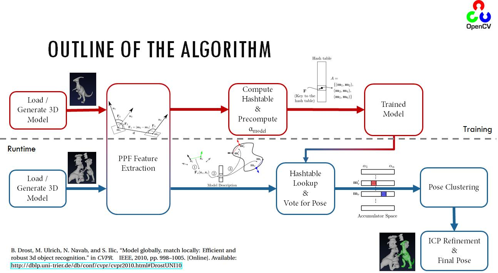
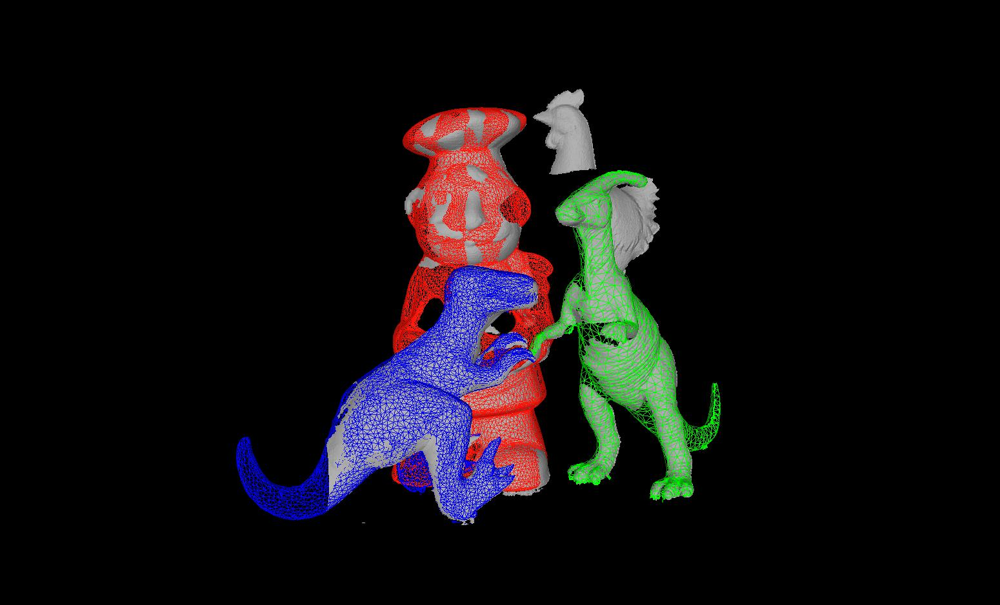

.. _surfacematching:

surface_matching. Surface Matching
**********************************

Introduction to Surface Matching
================================

Cameras and similar devices with the capability of sensation of 3D structure are becoming more common. Thus, using depth and intensity information for matching 3D objects (or parts) are of crucial importance for computer vision. Applications range from industrial control to guiding everyday actions for visually impaired people. The task in recognition and pose estimation in range images aims to identify and localize a queried 3D free-form object by matching it to the acquired database.

From an industrial perspective, enabling robots to automatically locate and pick up randomly placed and oriented objects from a bin is an important challenge in factory automation, replacing tedious and heavy manual labor. A system should be able to recognize and locate objects with a predefined shape and estimate the position with the precision necessary for a gripping robot to pick it up. This is where vision guided robotics takes the stage. Similar tools are also capable of guiding robots (and even people) through unstructured environments, leading to automated navigation. These properties make 3D matching from point clouds a ubiquitous necessity. Within this context, I will now describe the OpenCV implementation of a 3D object recognition and pose estimation algorithm using 3D features.

Surface Matching Algorithm Through 3D Features
==============================================

The state of the algorithms in order to achieve the task 3D matching is heavily based on [drost2010]_, which is one of the first and main practical methods presented in this area. The approach is composed of extracting 3D feature points randomly from depth images or generic point clouds, indexing them and later in runtime querying them efficiently. Only the 3D structure is considered, and a trivial hash table is used for feature queries.

While being fully aware that utilization of the nice CAD model structure in order to achieve a smart point sampling, I will be leaving that aside now in order to respect the generalizability of the methods (Typically for such algorithms training on a CAD model is not needed, and a point cloud would be sufficient). Below is the outline of the entire algorithm:

As explained, the algorithm relies on the extraction and indexing of point pair features, which are defined as follows:

.. math:: \bf{{F}}(\bf{{m1}}, \bf{{m2}}) = (||\bf{{d}}||_2, <(\bf{{n1}},\bf{{d}}), <(\bf{{n2}},\bf{{d}}), <(\bf{{n1}},\bf{{n2}}))

where :math:`\bf{{m1}}` and :math:`\bf{{m2}}` are feature two selected
points on the model (or scene), :math:`\bf{{d}}` is the difference
vector, :math:`\bf{{n1}}` and :math:`\bf{{n2}}` are the normals at
:math:`\bf{{m1}}` and :math:`\bf{m2}`. During the training stage, this
vector is quantized, indexed. In the test stage, same features are
extracted from the scene and compared to the database. With a few tricks
like separation of the rotational components, the pose estimation part
can also be made efficient (check the reference for more details). A
Hough-like voting and clustering is employed to estimate the object
pose. To cluster the poses, the raw pose hypotheses are sorted in decreasing order
of the number of votes. From the highest vote, a
new cluster is created. If the next pose hypothesis is close to one of
the existing clusters, the hypothesis is added to the cluster
and the cluster center is updated as the average of the pose
hypotheses within the cluster. If the next hypothesis is not
close to any of the clusters, it creates a new cluster. The
proximity testing is done with fixed thresholds in translation
and rotation. Distance computation and averaging for translation are performed in the 3D Euclidean space, while those
for rotation are performed using quaternion representation.
After clustering, the clusters are sorted in decreasing order
of the total number of votes which determines confidence of
the estimated poses.

This pose is further refined using :math:`ICP` in order to obtain
the final pose.

PPF presented above depends largely on robust computation of angles
between 3D vectors. Even though not reported in the paper, the naive way
of doing this (:math:`\theta = cos^{-1}({\bf{a}}\cdot{\bf{b}})` remains
numerically unstable. A better way to do this is then use inverse
tangents, like:

.. math:: 
	<(\bf{n1},\bf{n2})=tan^{-1}(||{\bf{n1}  \wedge \bf{n2}}||_2, \bf{n1} \cdot \bf{n2})

Rough Computation of Object Pose Given PPF
============================================

Let me summarize the following notation:

-  :math:`p^i_m`: :math:`i^{th}` point of the model (:math:`p^j_m`
   accordingly)

-  :math:`n^i_m`: Normal of the :math:`i^{th}` point of the model
   (:math:`n^j_m` accordingly)

-  :math:`p^i_s`: :math:`i^{th}` point of the scene (:math:`p^j_s`
   accordingly)

-  :math:`n^i_s`: Normal of the :math:`i^{th}` point of the scene
   (:math:`n^j_s` accordingly)

-  :math:`T_{m\rightarrow g}`: The transformation required to translate
   :math:`p^i_m` to the origin and rotate its normal :math:`n^i_m` onto
   the :math:`x`-axis.

-  :math:`R_{m\rightarrow g}`: Rotational component of
   :math:`T_{m\rightarrow g}`.

-  :math:`t_{m\rightarrow g}`: Translational component of
   :math:`T_{m\rightarrow g}`.

-  :math:`(p^i_m)^{'}`: :math:`i^{th}` point of the model transformed by
   :math:`T_{m\rightarrow g}`. (:math:`(p^j_m)^{'}` accordingly).

-  :math:`{\bf{R_{m\rightarrow g}}}`: Axis angle representation of
   rotation :math:`R_{m\rightarrow g}`.

-  :math:`\theta_{m\rightarrow g}`: The angular component of the axis
   angle representation :math:`{\bf{R_{m\rightarrow g}}}`.

The transformation in a point pair feature is computed by first finding the transformation :math:`T_{m\rightarrow g}` from the first point, and applying the same transformation to the second one. Transforming each point, together with the normal, to the ground plane leaves us with an angle to find out, during a comparison with a new point pair.

We could now simply start writing 

.. math::
	(p^i_m)^{'} = T_{m\rightarrow g} p^i_m
    
where

.. math::
	T_{m\rightarrow g} = -t_{m\rightarrow g}R_{m\rightarrow g} 

Note that this is nothing but a stacked transformation. The translational component :math:`t_{m\rightarrow g}` reads

.. math::
	t_{m\rightarrow g} = -R_{m\rightarrow g}p^i_m

and the rotational being

.. math::
	\theta_{m\rightarrow g} = \cos^{-1}(n^i_m \cdot {\bf{x}})\\
	{\bf{R_{m\rightarrow g}}} = n^i_m \wedge {\bf{x}}

in axis angle format. Note that bold refers to the vector form. After this transformation, the feature vectors of the model are registered onto the ground plane X and the angle with respect to :math:`x=0` is called :math:`\alpha_m`. Similarly, for the scene, it is called :math:`\alpha_s`.

Hough-like Voting Scheme
------------------------

As shown in the outline, PPF (point pair features) are extracted from the model, quantized, stored in the hashtable and indexed, during the training stage. During the runtime however, the similar operation is perfomed on the input scene with the exception that this time a similarity lookup over the hashtable is performed, instead of an insertion. This lookup also allows us to compute a transformation to the ground plane for the scene pairs. After this point, computing the rotational component of the pose reduces to computation of the difference :math:`\alpha=\alpha_m-\alpha_s`. This component carries
the cue about the object pose. A Hough-like voting scheme is performed over the local model coordinate vector and :math:`\alpha`. The highest poses achieved for every scene point lets us recover the object pose.

Source Code for PPF Matching
----------------------------

.. code-block:: cpp

	// pc is the loaded point cloud of the model
	// (Nx6) and pcTest is a loaded point cloud of 
	// the scene (Mx6)
	ppf_match_3d::PPF3DDetector detector(0.03, 0.05);
	detector.trainModel(pc);
	vector<Pose3DPtr> results;
	detector.match(pcTest, results, 1.0/10.0, 0.05);
	cout << "Poses: " << endl;
	// print the poses
	for (size_t i=0; i<results.size(); i++)
	{
	    Pose3DPtr pose = results[i];
	    cout << "Pose Result " << i << endl;
	    pose->printPose();
	}

Pose Registration via ICP
=========================

The matching process terminates with the attainment of the pose.
However, due to the multiple matching points, erroneous hypothesis, pose
averaging and etc. such pose is very open to noise and many times is far
from being perfect. Although the visual results obtained in that stage
are pleasing, the quantitative evaluation shows :math:`~10` degrees
variation (error), which is an acceptable level of matching. Many times, the requirement
might be set well beyond this margin and it is desired to refine the
computed pose.

Furthermore, in typical RGBD scenes and point clouds, 3D structure can capture only
less than half of the model due to the visibility in the scene.
Therefore, a robust pose refinement algorithm, which can register
occluded and partially visible shapes quickly and correctly is not an
unrealistic wish.

At this point, a trivial option would be to use the well known iterative
closest point algorithm . However, utilization of the basic ICP leads to
slow convergence, bad registration, outlier sensitivity and failure to
register partial shapes. Thus, it is definitely not suited to the
problem. For this reason, many variants have been proposed . Different
variants contribute to different stages of the pose estimation process.

ICP is composed of :math:`6` stages and the improvements I propose for
each stage is summarized below.

Sampling
--------

To improve convergence speed and computation time, it is common to use
less points than the model actually has. However, sampling the correct
points to register is an issue in itself. The naive way would be to
sample uniformly and hope to get a reasonable subset. More smarter ways
try to identify the critical points, which are found to highly
contribute to the registration process. Gelfand et. al. exploit the
covariance matrix in order to constrain the eigenspace, so that a set of
points which affect both translation and rotation are used. This is a
clever way of subsampling, which I will optionally be using in the
implementation.

Correspondence Search
---------------------

As the name implies, this step is actually the assignment of the points
in the data and the model in a closest point fashion. Correct
assignments will lead to a correct pose, where wrong assignments
strongly degrade the result. In general, KD-trees are used in the search
of nearest neighbors, to increase the speed. However this is not an
optimality guarantee and many times causes wrong points to be matched.
Luckily the assignments are corrected over iterations.

To overcome some of the limitations, Picky ICP [pickyicp]_ and BC-ICP (ICP using
bi-unique correspondences) are two well-known methods. Picky ICP first
finds the correspondences in the old-fashioned way and then among the
resulting corresponding pairs, if more than one scene point :math:`p_i`
is assigned to the same model point :math:`m_j`, it selects :math:`p_i`
that corresponds to the minimum distance. BC-ICP on the other hand,
allows multiple correspondences first and then resolves the assignments
by establishing bi-unique correspondences. It also defines a novel
no-correspondence outlier, which intrinsically eases the process of
identifying outliers.

For reference, both methods are used. Because P-ICP is a bit faster,
with not-so-significant performance drawback, it will be the method of
choice in refinment of correspondences.

Weighting of Pairs
------------------

In my implementation, I currently do not use a weighting scheme. But the
common approaches involve *normal compatibility*
(:math:`w_i=n^1_i\cdot n^2_j`) or assigning lower weights to point pairs
with greater distances
(:math:`w=1-\frac{||dist(m_i,s_i)||_2}{dist_{max}}`).

Rejection of Pairs
------------------

The rejections are done using a dynamic thresholding based on a robust
estimate of the standard deviation. In other words, in each iteration, I
find the MAD estimate of the Std. Dev. I denote this as :math:`mad_i`. I
reject the pairs with distances :math:`d_i>\tau mad_i`. Here
:math:`\tau` is the threshold of rejection and by default set to
:math:`3`. The weighting is applied prior to Picky refinement, explained
in the previous stage.

Error Metric
------------

As described in , a linearization of point to plane as in [koklimlow]_ error metric is
used. This both speeds up the registration process and improves convergence.

Minimization
------------

Even though many non-linear optimizers (such as Levenberg Mardquardt)
are proposed, due to the linearization in the previous step, pose
estimation reduces to solving a linear system of equations. This is what
I do exactly using cv::solve with DECOMP_SVD option.

ICP Algorithm
-------------

Having described the steps above, here I summarize the layout of the ICP
algorithm.

Efficient ICP Through Point Cloud Pyramids
^^^^^^^^^^^^^^^^^^^^^^^^^^^^^^^^^^^^^^^^^^

While the up-to-now-proposed variants deal well with some outliers and
bad initializations, they require significant number of iterations. Yet,
multi-resolution scheme can help reducing the number of iterations by
allowing the registration to start from a coarse level and propagate to
the lower and finer levels. Such approach both improves the performances
and enhances the runtime.

The search is done through multiple levels, in a hierarchical fashion.
The registration starts with a very coarse set of samples of the model.
Iteratively, the points are densified and sought. After each iteration
the previously estimated pose is used as an initial pose and refined
with the ICP.

Visual Results
^^^^^^^^^^^^^^

Results on Synthetic Data
~~~~~~~~~~~~~~~~~~~~~~~~~

In all of the results, the pose is initiated by PPF and the rest is left as:
:math:`[\theta_x, \theta_y, \theta_z, t_x, t_y, t_z]=[0]`

Source Code for Pose Refinement Using ICP
-----------------------------------------

.. code-block:: cpp

	ICP icp(200, 0.001f, 2.5f, 8);
	// Using the previously declared pc and pcTest
	// This will perform registration for every pose
	// contained in results
	icp.registerModelToScene(pc, pcTest, results);
	
	// results now contain the refined poses

Results
=======

This section is dedicated to the results of surface matching (point-pair-feature matching
and a following ICP refinement):

.. image:: surface_matching/pics/gsoc_forg_matches.jpg
	:scale: 65 %
	:align: center
	:alt: Several matches of a single frog model using ppf + icp

Matches of different models for Mian dataset is presented below:

You might checkout the video on `youTube here <http://www.youtube.com/watch?v=uFnqLFznuZU>`_.

.. raw:: html

	

	<iframe width="775" height="436" src="http://www.youtube.com/embed/uFnqLFznuZU?list=UUMSqZYDAmbiaAhyvLPJGhsg" frameborder="0" allowfullscreen></iframe>
	

A Complete Sample
=================
.. literalinclude:: surface_matching/src/ppf_load_match.cpp
   :language: cpp
   :linenos:
   :tab-width: 4
   
   
Parameter Tuning
----------------

Surface matching module treats its parameters relative to the model diameter (diameter of the axis parallel bounding box), whenever it can. This makes the parameters independent from the model size. This is why, both model and scene cloud were subsampled such that all points have a minimum distance of :math:`RelativeSamplingStep*DimensionRange`, where :math:`DimensionRange` is the distance along a given dimension. All three dimensions are sampled in similar manner. For example, if :math:`RelativeSamplingStep` is set to 0.05 and the diameter of model is 1m (1000mm), the points sampled from the object's surface will be approximately 50 mm apart. From another point of view, if the sampling RelativeSamplingStep is set to 0.05, at most :math:`20x20x20 = 8000` model points are generated (depending on how the model fills in the volume). Consequently this results in at most 8000x8000 pairs. In practice, because the models are not uniformly distributed over a rectangular prism, much less points are to be expected. Decreasing this value, results in more model points and thus a more accurate representation. However, note that number of point pair features to be computed is now quadratically increased as the complexity is O(N^2). This is especially a concern for 32 bit systems, where large models can easily overshoot the available memory. Typically, values in the range of 0.025 - 0.05 seem adequate for most of the applications, where the default value is 0.03. (Note that there is a difference in this paremeter with the one presented in [drost2010]_. In [drost2010]_ a uniform cuboid is used for quantization and model diameter is used for reference of sampling. In my implementation, the cuboid is a rectangular prism, and each dimension is quantized independently. I do not take reference from the diameter but along the individual dimensions.

It would very wise to remove the outliers from the model and prepare an ideal model initially. This is because, the outliers directly affect the relative computations and degrade the matching accuracy. 

During runtime stage, the scene is again sampled by :math:`RelativeSamplingStep`, as described above. However this time, only a portion of the scene points are used as reference. This portion is controlled by the parameter :math:`RelativeSceneSampleStep`, where :math:`SceneSampleStep = (int)(1.0/RelativeSceneSampleStep)`. In other words, if the :math:`RelativeSceneSampleStep = 1.0/5.0`, the subsampled scene will once again be uniformly sampled to 1/5 of the number of points. Maximum value of this parameter is 1 and increasing this parameter also increases the stability, but decreases the speed. Again, because of the initial scene-independent relative sampling, fine tuning this parameter is not a big concern. This would only be an issue when the model shape occupies a volume uniformly, or when the model shape is condensed in a tiny place within the quantization volume (e.g. The octree representation would have too much empty cells). 

:math:`RelativeDistanceStep` acts as a step of discretization over the hash table. The point pair features are quantized to be mapped to the buckets of the hashtable. This discretization involves a multiplication and a casting to the integer. Adjusting RelativeDistanceStep in theory controls the collision rate. Note that, more collisions on the hashtable results in less accurate estimations. Reducing this parameter increases the affect of quantization but starts to assign non-similar point pairs to the same bins. Increasing it however, wanes the ability to group the similar pairs. Generally, because during the sampling stage, the training model points are selected uniformly with a distance controlled by RelativeSamplingStep, RelativeDistanceStep is expected to equate to this value. Yet again, values in the range of 0.025-0.05 are sensible. This time however, when the model is dense, it is not advised to decrease this value. For noisy scenes, the value can be increased to improve the robustness of the matching against noisy points. 

References
==========

.. [drost2010] B. Drost, S. Ilic 3D Object Detection and Localization Using Multimodal Point Pair Features Second Joint 3DIM/3DPVT Conference: 3D Imaging, Modeling, Processing, Visualization & Transmission (3DIMPVT), Zurich, Switzerland, October 2012

.. [pickyicp] Zinsser, Timo and Schmidt, Jochen and Niemann, Heinrich A refined ICP algorithm for robust 3-D correspondence estimation Image Processing, 2003. ICIP 2003. Proceedings. 2003 International Conference on Image Processing, IEEE.

.. [koklimlow] Kok Lim Low, Linear Least-Squares Optimization for Point-to-Plane ICP Surface Registration Technical Report TR04-004, Department of Computer Science, University of North Carolina at Chapel Hill, February 2004

