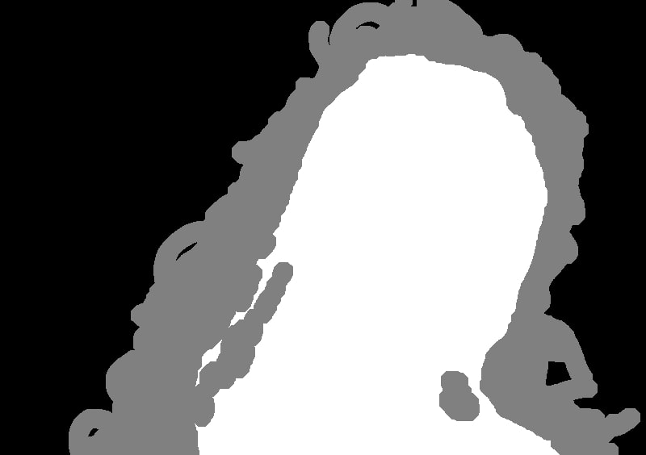
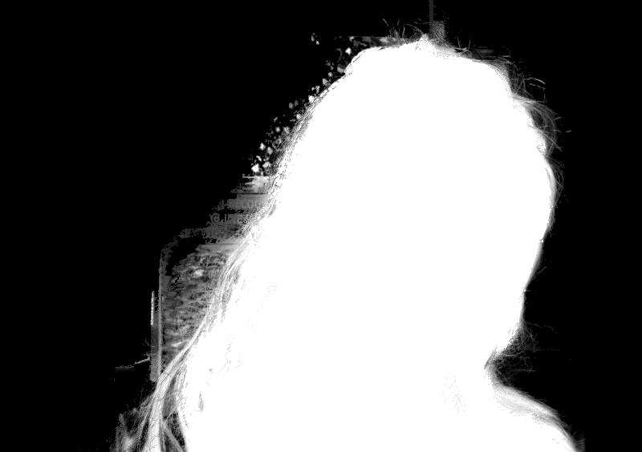
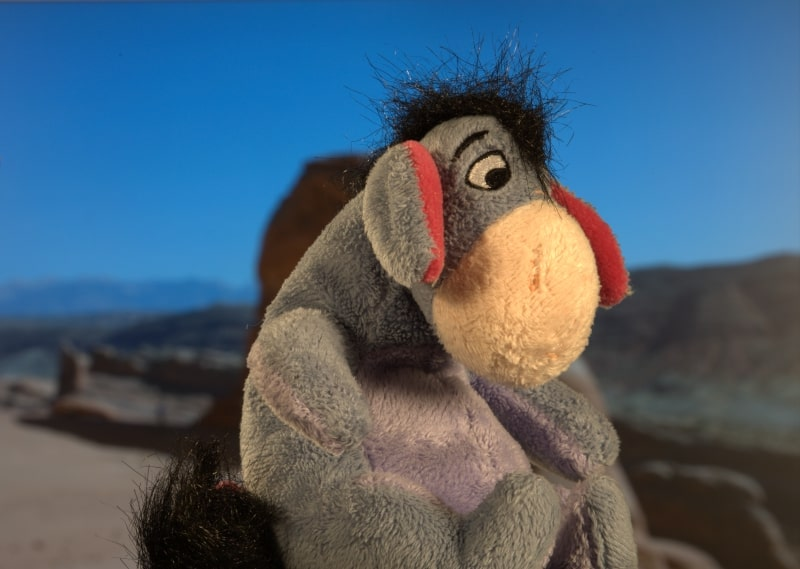
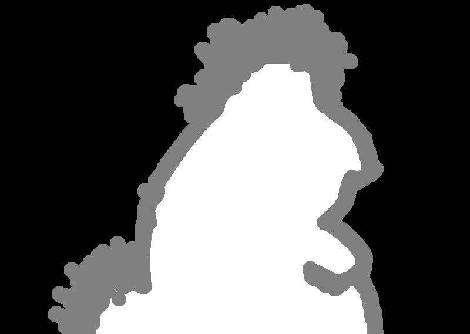
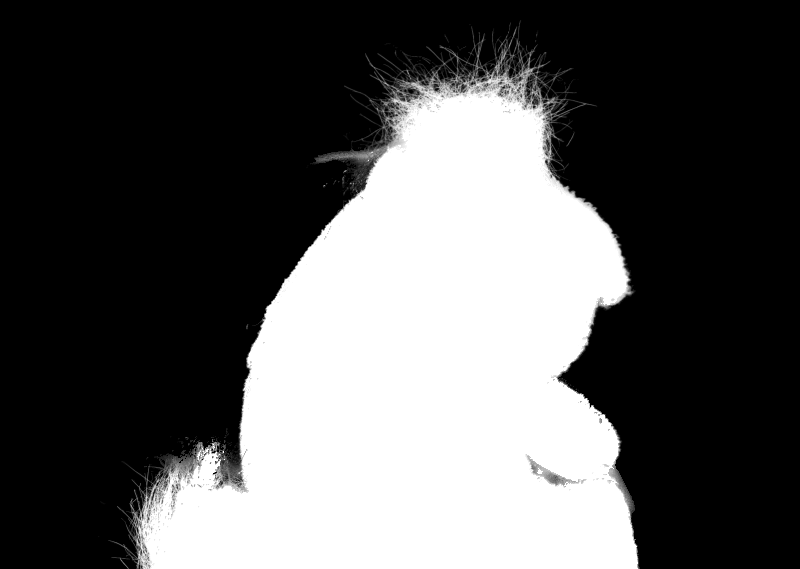
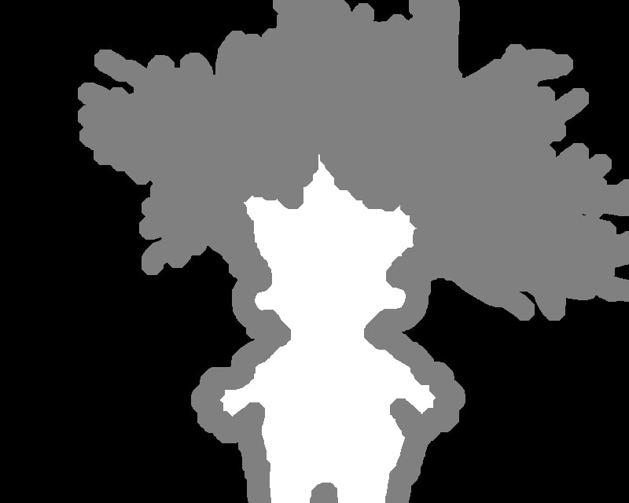
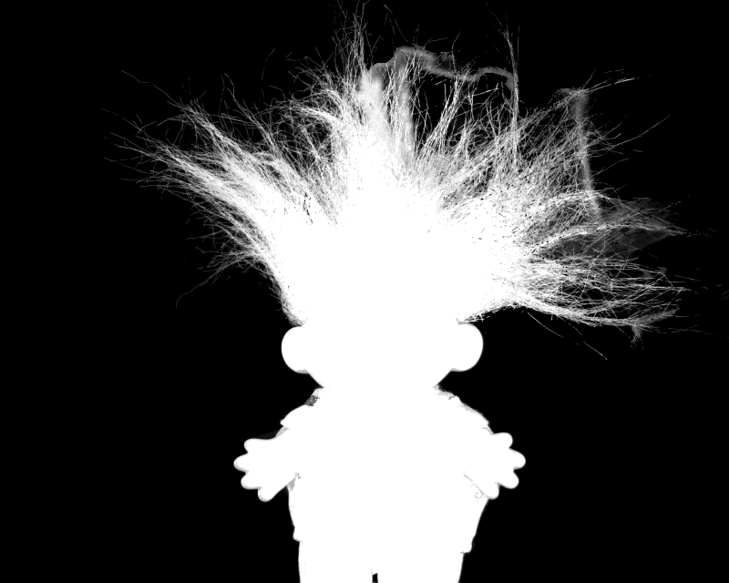

### A Global sampling method for Alpha Matting ###

The Global sampling based method uses all known samples(from a trimap), Unlike other sampling based methods
which collect only nearby samples. 
It first estimates the foreground and background color and uses them to compute the alpha matte.

Input to the model is the Image and the trimap, and the output is the alpha matte of the image.

This [blog post](https://medium.com/vedacv/paper-summary-a-global-sampling-method-for-alpha-matting-490a4217eb2) gives a summary of the paper.

### Results ###

After evaluating this implementation on alphamatting.com, the results are almost as good as the original implementation.

Following were the results:

|     Error type              |      Original implementation    | This implementation  |
|     -----------             |      ------------------------   | -------------------  |
| Sum of absolute differences |       31                        | 31.3                 |
| Mean square error           |       28.3                      | 29.5                 |
| Gradient error              |       25                        | 26.3                 |
| Connectivity error          |       28                        | 36.3                 |

Some of the outputs with of this implementation are as follows :

|    Image                    | Trimap                          | Alpha matte(this implementation)  |
|  --------------             | --------------                  | ------------------------          |
| | | |
| | | |
| | | |
