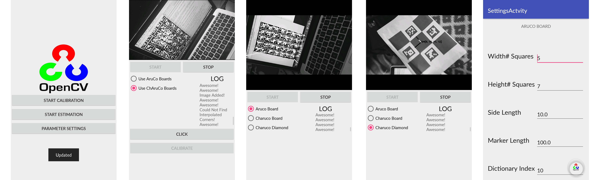

# Aruco OpenCV Android App
This is a sample Android app that uses OpenCV Aruco module showcasing all it's samples. This applications includes the following features:

- *Inbuild Calibration*: You can calibrate your phone camera using this application via both ChAruCo and AruCo boards. 
- *Open Parameter Panel*: You can edit parameter from the settings directly. You can also edit the camera parameters and the Aruco API level parameters by editing files created in the application folder.
- *Live Analysis with Logs*: You can test the application on all three - Charuco board, Aruco board and Charuco diamond in real time and view a log of events.

## Setup

**Target SDK** - Android 23

**Minimum SDK** - Android 21

- Clone the repository and open the project in android studio.
- Compiled opencv_contrib module libraries are added to repository. Alternatively you can build them from source as well. 
- The files that will require path changes to be made are:
  - *pose_estimation/app/build.gradle*
  - *pose_estimation/app/src/main/jni/Android.mk*

## Snapshots

From Left to Right - *Home Screen, Calibration Screen, Pose Estimation Screen & Parameter Editing Screen.*

## Future Work 

- Increase Quality of Logs.
- Add in-app editing of camera and api parameters. (A part of the code  has been written for this. A few JNI bugs have halted the progress)

